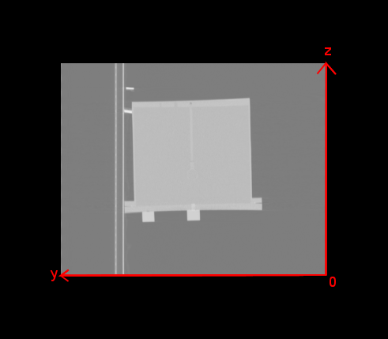
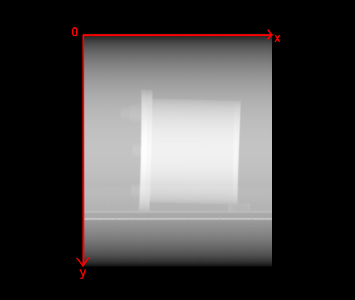
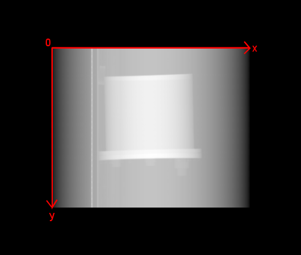
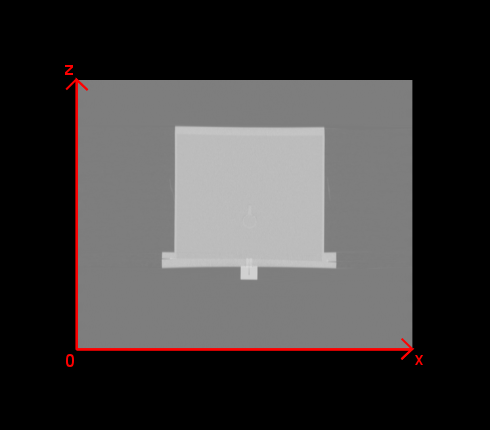
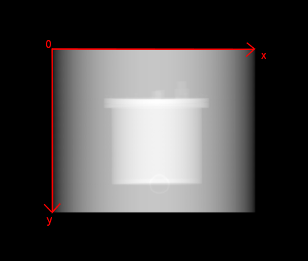
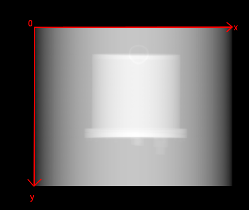

# FAF calibration

## 1. Command Line tools


- **sydInsertPlanarGeometricalMean**

`sydInsertPlanarGeometricalMean <image> -k 0.5`

Create a new (mhd) image with the geometrical mean of planar images. `<image>`  must be a single image with 4 slices (ANT_EM, POST_EM, ANT_SC, POST_SC) for respectively the image from the anterior detector, the image from the posterior detector for the primary and the scattering. The calculation is:
$$
\sqrt{(ANT_{EM} - k*ANT_{SC}) * flip(POST_{EM} - k*POST_{SC})}
$$

- **sydInsertAttenuationImage**

`sydInsertAttenuationImage <image> -c [water,bone] -s [air1,water1,bone1,air2,water2,bone2] -p [%1,%2`

Create a new (mhd) image with the conversion of CT's HU into attenuation coefficients.`<image>`  must be a CT image. The tag ` --attenuationCT (or -c)` corresponds to the attenuation coefficients for water and bone (respect the order) for mean energy of the X-ray used for CT (2 expected values).
The tag `--attenuationSPECT (or -s)` corresponds to the attenuation coefficients for air, water and bone (respect the order) for all targeted energies of the SPECT. The tag `--percentage (or -p)` corresponds to the normalized percentage for all targeted energies of the SPECT (sum =1). If there is just 1 targeted energy, this parameter is optional. According to GE, the calculation from CT HU can be separated in 2 parts:
 > if the CT value ≤ 0: 
$$ μ_{material}^{[kEV]} = μ_{water}^{[kEV]} + { {μ_{water}^{[kEV]} - μ_{air}^{[kEV]} }\over{1000} }*CT$$

 > if the CT value > 0:
$$ μ_{material}^{[kEV]} = μ_{water}^{[kEV]} + { {μ_{water}^{[kV_{eff}]} }\over{μ_{bone}^{[kV_{eff}]} - μ_{water}^{[kV_{eff}]} } }.{ {μ_{bone}^{[kEV]} - μ_{water}^{[kEV]} }\over{1000} }*CT$$

 > with:
 > - CT the value of the CT in HU
 > - μ the value of the attenuation in $$ mm^{-1} $$ for water, air and bone at different energy levels. Values of reference can be found here : http://physics.nist.gov/PhysRefData/XrayMassCoef/tab4.html
 > - kEV the energy of the photopeak of the radionuclide. Reference value of energy can be found here http://www.nucleide.org/DDEP_WG/DDEPdata.htm
 > - kVeff the mean energy of the X-ray used for CT. kVeff is assumed to be one half or one third of kVPeak with kVPeak found in the Dicom Tag "(0018,0060) KVP"

> With radionuclide having complex energy spectrum (e.g. several photopeaks or large continuous spectrum), the total attenuation map is computed by weighted sum of the different considered energies. For example, with two peaks EV1 and EV2 with weight w1 and w2:  $$ μ_{material}^{total} = w1 * μ_{material}^{[kEV1]} + w2 * μ_{material}^{[kEV2]}$$


- **sydInsertProjectionImage**

`sydInsertProjectionImage <image> --dimension 2 [--mean] [--no-flip]`

Take a 3D image to create a new 2D (mhd) image with the projected image along the dimension ```--dimension (or -d)```. The resulted voxel is the sum of all voxel values along the dimension `-d`. The tag ```--mean (or -m)``` can be set to compute the mean (eg.: for CT) instead of the sum (eg.: for SPECT). The algorithm uses ```itk::SumProjectionImageFilter``` to project the image but the axes are flipped in the resulting image. Automatically, the image is righted (ie. same orientation than the original image). Set the flag ```--no-flip (or -f)``` to conserve the result of ```itk::SumProjectionImageFilter```.

> When d=0, the image is projected along the x-axis, the flip is presented in the following statement.
> The original view is represented in the next screenshot.



> The y-axis stays the same but the new x-axis corresponds to the old z-axis. So the phantom is upside down:



> We have to flip it to be aligned with the original image:



> When d=1, the image is projected along the y-axis, the flip is presented in the following statement.
> The original view is like this:



> After the projection the y-axis is replaced by the old z-axis. As a consequence, the phantom appears to be upside down:



> And to be correctly registered with the original image, the image has to be flipped:



> When d=2, the image is projected along the z-axis but in a such case, no extra-flip is needed.

- Registration ?
Input: 2D geometrical mean image + 2D projection image (from attenuation)
Output: 2D translations only
Solution1: could it be possible to automatically find translations from the input images information ? 
Solution2: allows users to change by something like sydTranslateImage `<image>` x y z ?


- **sydInsertAttenuationCorrectedProjectionImage**

`sydInsertAttenuationCorrectedProjectionImage <images1> <images2> --dimension d`

Create a new (mhd) image from the 2D Geometric Mean (GM) using the projected attenuation map. `<images1>` is a GM image and `<images2>` is an attenuation map. The attenuation map is projected along the d-axis given by `--dimension (or -d)` of spacing $$spacing_d$$ and size $$nbVoxel_d$$.The result is computed as:

$$GM_{corrected} = GM * \exp{(2*attenuationMap*nbVoxel_d*spacing_d)}$$ ???

- **sydCalibrateImage**

`sydCalibrateImage <image_ids> [--scale 1.0] [--by_IA]`

Perform image calibration: consider the first image of the list (according to
acquisition time), compute activity by detected counts (assuming whole activity
in the image fov). Convert all images with the calibration factor. The pixel
unit is changed to Bq.
It can be adapted to use need by using --scale (or `-s`) and --pixel_unit option.
The default pixel unit is in Bq. If the option --by_IA (or `-n`) is used, new injection
with 1 MBq injected activity is created and linked to the images.


## 2. API

In file `std_db/sydImageHelper.h\cxx`

- ```double ComputeActivityInMBqByDetectedCounts(syd::Image::pointer image)```

- ```void syd::ScaleImage(syd::Image::pointer image, double s)```

- ```syd::Image::pointer syd::InsertImageGeometricalMean(const syd::Image::pointer input, double k)```

- ```syd::Image::pointer InsertProjectionImage(const syd::Image::pointer input, double dimension=0, bool mean=false, bool flip=false);```

- ```syd::Image::pointer InsertAttenuationImage(const syd::Image::pointer input, double numberEnergySPECT, double attenuationWaterCT, double attenuationBoneCT, std::vector<double>& attenuationAirSPECT, std::vector<double>& attenuationWaterSPECT, std::vector<double>& attenuationBoneSPECT, std::vector<double>& percentage);```

In file `core/sydImageGeometricalMean.h\txx`

- ```template<class ImageType> typename ImageType::Pointer syd::GeometricalMean(const ImageType * ant_em, const ImageType * post_em, const ImageType * ant_sc, const ImageType * post_sc, double k)``` : Main function to compute geometrical mean and call the next functions. Start correcting the scattering for both the ant and the post images, flip the post image and then compute the geometrical mean between these two images.

- ```template<class ImageType> typename ImageType::Pointer syd::RemoveScatter(const ImageType * em, const ImageType * sc, double k)``` : Remove the scattering. Compute $$ em - k*sc $$.

- ```template<class ImageType> typename ImageType::Pointer syd::GeometricalMean(const ImageType * ant, const ImageType * post)``` : Compute the geometrical mean $$ \sqrt{ant * post} $$.

In file `core/sydProjectionImage.h\txx`

- ```template<class ImageType, class OutputImageType> typename OutputImageType::Pointer Projection(const ImageType * input, double dimension, bool mean, bool flip)``` : Call the next function to project the input image, and then compute the mean and flip if necessary

- ```template<class ImageType, class OutputImageType> typename OutputImageType::Pointer Projection(const ImageType * input, double dimension);``` : 
Call ```itk::SumProjectionImageFilter``` to project the input image along the dimension `dimension`

In file `core/sydAttenuationImage.h\txx`

- ```template<class ImageType> typename ImageType::Pointer Attenuation(const ImageType * input, double numberEnergySPECT, double attenuationWaterCT, double attenuationBoneCT, std::vector<double>& attenuationAirSPECT, std::vector<double>& attenuationWaterSPECT, std::vector<double>& attenuationBoneSPECT, std::vector<double>& percentage);``` : Compute the formula described above.
