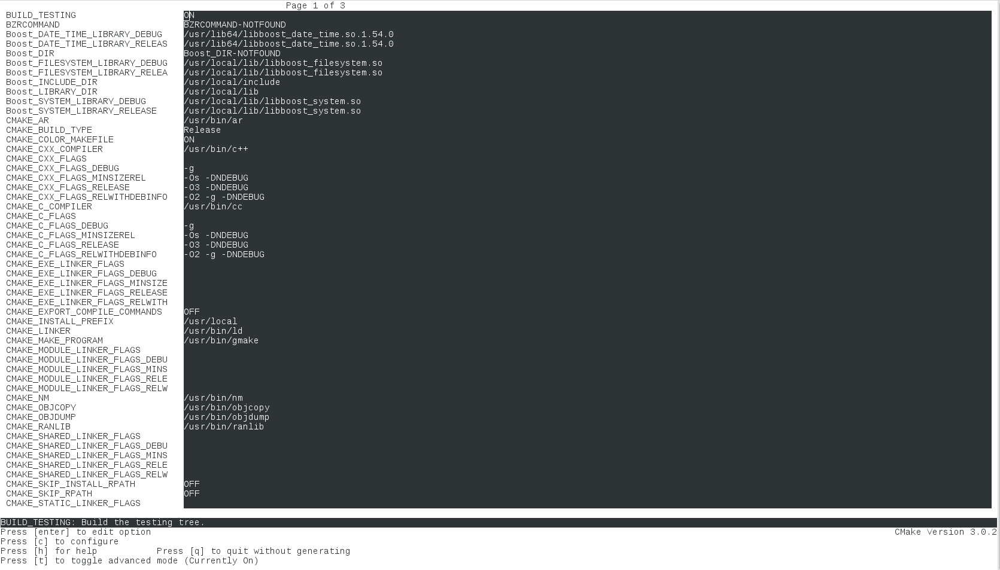

# Installation

You need c++ compiler, git, cmake. Works under linux and mac osx. For Windows ... (it's a joke?).

There are a lot of dependencies, it is not easy to install. Dependencies are: ODB, ITK, DCMTK, Ceres-solver, Boost...

### Install ODB 

* For object-oriented database management : "_ODB is an object-relational mapping (ORM) system for C++. It provides tools, APIs, and library support that allow you to persist C++ objects to a relational database (RDBMS) without having to deal with tables, columns, or SQL and without manually writing any of the mapping code._"
* See http://www.codesynthesis.com/products/odb
* Work with version >= 2.4.0
* Need 3 parts to be installed: 1) odb compiler 2) libodb and 3) libodb-sqlite
* You may need to manually install sqlite to ensure proper install of libodb-sqlite
* (Consider running odb tests to ensure proper installation)
* for Mac osx:
  * Download and uncompress odb compiler binaries: http://www.codesynthesis.com/download/odb/2.4/odb-2.4.0-i686-macosx.tar.bz2
  * Download, compile from source for libodb and libodb)sqlite: http://www.codesynthesis.com/download/odb/2.4/libodb-sqlite-2.4.0.tar.bz2 and http://www.codesynthesis.com/download/odb/2.4/libodb-2.4.0.tar.bz2

<!-- , use homebrew https://github.com/Max13/homebrew-odb -->
<!--  * `brew tap max13/odb` -->
<!--  * `brew install odb` -->
<!--  * `brew install libodb` -->
<!--  * `brew link --overwrite  libodb` -->
<!--  * `brew install libodb-sqlite` -->
<!--  * `brew link --overwrite  libodb-sqlite` -->

### Install ITK 

* For image processing
* See [itk.org](http://www.itk.org)
* Work with version >= 4.5.2
* (Make sure you use `BUILD_SHARED_LIBS=ON`)
* because c++11 is needed for syd, you need to compile ITK also with c++11. Use:`ccmake -DCMAKE_CXX_FLAGS=-std=c++11 ../InsightToolkit-4.8.0`. Note that this option *must* be set before any `ccmake`.
* You may want to set the env variable: `export ITK_DIR=/my_path/build-itk`

### Install DCMTK 
* For Dicom processing
* See [dicom.offis.de](http://dicom.offis.de/dcmtk.php.en)
* Work with version >= 3.6.0
* DCMTK 3.6.0, latest public version may not compile with latest version of gcc installed in your system. Please consider using newer shapshot of DCMTK.
* You need to activate BUILD_SHARED_LIBS=ON , consider using CMake instead of the recommended './configure' file

### Install Boost  
* [boost.org](http://www.boost.org)
* Extended C++ library
* Version > 1.40
* Needed modules are: `date_time`, `system` and `filesystem`
* For building `date_time` module, you need to install libquadmath-devel package. If this package is not available, you may install boost with your package manager
* Beware, boost modules installed with your package manager may not work properly for OpenSyd compilation (cases were reported with libboost_filesystem in particular).


### Install Ceres-solver  
* [ceres-solver.org](http://www.ceres-solver.org)
* For fit and optimisation
* Need eigen and glog
* Version > 1.11
* Librairies for Sparse calculation are optional for OpenSyd
* Be sure you complete installation (ccmake, make, make install) 

### SYD: download and compile the source

* `git clone https://github.com/OpenSyd/syd.git`
* `mkdir build ; cd build`
* `ccmake ../syd`
Provide ITK_DIR, and other path to dependence libraries, then type 'c' and 'g' to configure and generate makefiles). If you download binary version of odb, provide path to odb executable. The path for boost libraries is a little tricky. You can find an example in the next screenshot.



* `make -j 4`

Once compiled, the libraries are in `build/lib` and the executable in `build/bin`. You **need** to set the environment variable `SYD_PLUGIN` to point to the libraries, for example:

``` sh
export SYD_PLUGIN=/my_path/build/lib:${SYD_PLUGIN}
```
